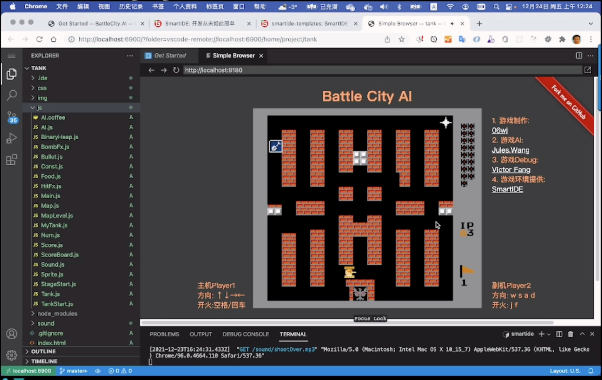

# SmartIDE 坦克大战

儿时的记忆【坦克大战】现在可以运行在你最爱的vscode WebIDE里面了。

本代码库提供在 VSCode webIDE 中运行【坦克大战】的方式

- B站视频教程：https://www.bilibili.com/video/BV1QL41157P5
- 在线试玩：https://smartide.gitee.io/battle-city-ai/

大家如果觉得好，别忘了B站三连+GitHub/Gitee加星哦！

## 开玩说明

在 VSCode WebIDE 中运行堂课大战只需要3个步骤，你无需在本地安装 javascript 或者 node.js 开发环境，也无需提前安装 VSCode。

1. 安装 SmartIDE

  按照 SmarIDE 命令行工具：[安装说明](https://smartide.cn/zh/docs/install/)，支持 Windows 和 MacOS

2. 克隆本代码库

  使用以下脚本克隆本代码库内容
  ```shell
  ## 中国开发者可以使用 Gitee 镜像地址
  git clone https://gitee.com/smartide/battle-city-ai.git
  ## 如果你能访问 GitHu，也可以直接使用
  git clone https://github.com/SmartIDE/battle-city-ai.git
  ```

3. smartide start

  ```shell
  ## 进入clone的代码库目录
  cd battle-city-ai
  smartide start
  ```

smartide start 会自动完成以下动作

- 读取代码库中 .ide/.ide.yaml 文件
- 按以上配置文件拉取所需要的docker容器镜像，本代码库使用的是 smartide-base 镜像，内置了 javascript/node.js 开发环境和 VSCode WebIDE
- 镜像拉取完成后，会自动用docker启动容器并将本代码库的内容映射到容器内部
- 然后会自动开启VSCode WebIDE，并运行以下脚本
    - npm config set registry https://registry.npmmirror.com
    - npm install
    - npm start
- 以上动作玩不为 **自动** 完成，无需人工干预

完成后使用浏览器打开 http://localhost:8080 即可开玩。

游戏运行画面




## 开源贡献

原项目地址

- http://juleswang.github.io/BattleCity.AI/
- https://github.com/JulesWang/BattleCity.AI
